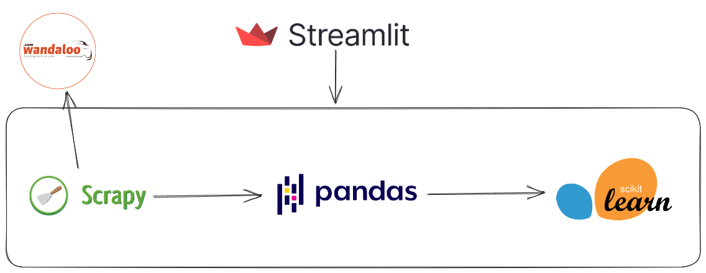

# 🚗   Car Price  💰 - `Prediction` :

    

 

**`Project Architecture :`**

 **`Problem Statement`** : **MedCars** a location agency on a mission to refine its vehicle procurement process, strategically balancing the realms of quality and budgetary constraints. Recognizing the wealth of insights available on <a href="https://www.wandaloo.com/" target="_blank">**Wandaloo.com**</a>, including car prices and other market dynamics, they seek to make informed decisions that serve their dual objectives. Their latest venture involves the development of a predictive model for car prices, driven by a commitment to streamline procurement efficiency. The core motivation here is to ensure that their budget is judiciously allocated, all while upholding the highest standards of quality. This predictive prowess not only promises operational benefits but also opens doors to potential negotiation advantages, ultimately empowering the agency to maintain a competitive pricing edge.
Now, as they embark on this predictive journey, several pivotal questions must be addressed:
> - How can historical car price data and market trends be harnessed to craft a highly accurate predictive model?
> - In the quest for precision, what machine learning algorithms and data sources should be meticulously considered in the development of this car price prediction model?
> - In practical terms, how can the agency seamlessly integrate this predictive pricing capability into their broader procurement strategy, harnessing it to maximize both cost savings and quality assurance?

- 🎯 **`Business Goal`** : We are required in this **`notebook`** to **model the price of cars with the available independent variables**. It will be used by the users or  related car companies to understand how exactly the prices vary with the independent variables. They can accordingly understand what factors play for the value of the cars, the business strategy, etc. to meet certain price levels. Further, the model will be a good way for management to understand the pricing dynamics of a new market.

- 📫 Feel free to contact me if anything is wrong or if anything needs to be changed 😎!  **medhajjari9@gmail.com**

